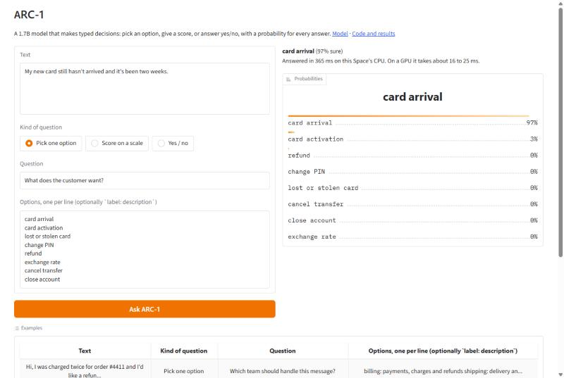

# ARC-1

ARC-1 is a small decision model. You give it some context and a question, and it picks an option, gives a score
or answers yes/no, with a probability for every answer. It has 1.7B parameters, runs on a normal gaming GPU and
answers a short request in about 16 ms.

I built it over 11 days on a single RTX 4060 Ti. The question I wanted to answer was how close a small model that
runs on your own machine can get to hosted decision APIs like Jev. Short version: it is a lot faster and you can
run it offline, but it is not as accurate yet. All the numbers are below, including the ones where it loses.

- Weights: [huggingface.co/realslapout/ARC-1](https://huggingface.co/realslapout/ARC-1)
- Demo: [huggingface.co/spaces/realslapout/ARC-1-demo](https://huggingface.co/spaces/realslapout/ARC-1-demo)



## Quick start

```bash
pip install git+https://github.com/realslapout/arc-1
```

```python
from arc1 import ARC1Predictor

model = ARC1Predictor("realslapout/ARC-1")   # downloads ~3.5 GB the first time

state = {"ticket": "I was charged twice for the same order and I want my money back."}
questions = {
    "team": {
        "type": "choice",
        "instructions": "Which team should handle `ticket`?",
        "criteria": {
            "billing": "payments, charges and refunds",
            "shipping": "delivery problems",
            "tech": "app or login problems",
        },
    },
    "urgency": {
        "type": "score",
        "instructions": "How urgent is `ticket`?",
        "criteria": ["not urgent", "normal", "urgent"],
    },
    "angry": {"type": "noul", "instructions": "Is the customer angry?"},
}

answers = model.predict(state, questions)["answers"]
print(answers["team"]["choice"], answers["team"]["probabilities"])
print(answers["urgency"]["score"])
print(answers["angry"]["noul"])
```

```text
billing {'billing': 0.991669, 'shipping': 0.006424, 'tech': 0.001907}
1.0302799518917043
0.9748723399342193
```

(Measured on a GPU in bf16. On a CPU the numbers come out slightly different, for example billing 0.997.)

Every answer also carries `answer_confidence`, and `score` answers include the probability of each level. All
questions about the same state are answered in one forward pass, so asking three questions costs not much more
than asking one.

For the lowest latency on a GPU, turn on CUDA graphs:

```python
model = ARC1Predictor("realslapout/ARC-1", cuda_graphs=True)
```

It also runs on a CPU (`device="cpu"`), at roughly 0.4 s per short request with two threads.

## Question types

| type | what you give it | what you get back |
|---|---|---|
| `choice` | `criteria`: a dict `{label: description}` or a plain list of labels | the chosen label and a probability for each label |
| `score` | `criteria`: a list of levels from lowest to highest | the expected level (a float) and a probability for each level |
| `noul` | only `instructions` (a yes/no statement or question) | the probability that the answer is yes |

`state` can be a string, a dict or a list (for example a chat history). Refer to its fields in the instructions
with backticks, like `` `ticket` ``. The input window is 1,024 tokens. Longer states are cut, and a list keeps its
most recent entries. A choice question can have many options: lists that do not fit the window are scored in
chunks.

## Results

### Decision benchmarks that ARC-1 was not trained on

| model | size | JevBench public 231 | DecideBench v1.1 | speed |
|---|---|---|---|---|
| **ARC-1** | 1.7B, open | **68.4** | **75.5** | 25 ms median on an RTX 4060 Ti (local) |
| Jev 1.13.0 | undisclosed, API | 86.6 | 98.0 | ~620 ms median (API, network included) |
| Strands Decider 2B | 1.9B, open | 72.3 \* | – | 115 ms median on an RTX 3090 \* |
| decider-2b | 1.9B, open | 71.0 | – | – |
| Laya | 421M, open | 58.4 | 59.8 | – |

Accuracy in %. JevBench public 231 is the 231 published JevBench items. The other models' results come from
[the JevBench repository](https://github.com/fstandhartinger/jevbench) (results v1.2), and ARC-1 is measured on
the same items. DecideBench numbers for other models come from [DecideBench](https://github.com/choyiny/decidebench),
and ARC-1 is measured on our copy of DecideBench v1.1 (400 items). \* = reported by the authors.

So, to be clear: Jev is much more accurate, and the two other ~2B models are a few points better on JevBench.
What ARC-1 has going for it is speed, running locally, and being free and open.

### Held-out items of the training tasks

Most of these datasets, or close relatives of them, are in the training data, so read these as in-domain results
on held-out items (anything that overlapped with the evaluation items was removed from training).

| task | dataset | metric | ARC-1 |
|---|---|---|---|
| banking intents (77 options) | Banking77 | accuracy | 87.2 |
| assistant intents (150 options) | CLINC150 | accuracy | 92.0 |
| assistant intents, English (60) | MASSIVE | accuracy | 84.2 |
| assistant intents, 16 languages (20 options) | MASSIVE | accuracy | 80.7 |
| news topic | AG News | accuracy | 90.6 |
| entity type | DBpedia-14 | accuracy | 99.2 |
| natural-language inference | MNLI | accuracy | 83.0 |
| adversarial NLI | ANLI | accuracy | 52.2 |
| NLI, 12 languages | XNLI | accuracy | 71.0 |
| yes/no questions | BoolQ | accuracy | 82.6 |
| duplicate questions | QQP | balanced accuracy | 82.5 |
| paraphrase, 7 languages | PAWS-X | accuracy | 83.6 |
| toxic chat messages | ToxicChat | balanced accuracy | 89.4 |
| jailbreak attempts | ToxicChat | balanced accuracy | 94.9 |
| prompt injection | deepset prompt-injections | balanced accuracy | 82.3 |
| spam | Enron spam | balanced accuracy | 91.5 |
| tool selection (2 to 256 tools to choose from) | Glaive function calling v2 | accuracy | 89.0 |

One safety set that is not in the training data: on [XSTest](https://huggingface.co/datasets/Paul/XSTest) (safe
prompts that look unsafe, plus unsafe contrasts), ARC-1 gets 88.9% balanced accuracy, so it mostly doesn't
refuse harmless requests just because of scary words.

### Speed

Measured with this package on an RTX 4060 Ti 16 GB, batch size 1, bf16, CUDA graphs on:

| request | median latency |
|---|---|
| short request (~60 tokens, 3–4 options) | 16 ms |
| JevBench items with 4 options | 25 ms (90th percentile 100 ms) |
| full 1,024-token input | ~100 ms |

Latency grows with the input length because the model reads the whole state on every request. GPU memory use
is about 4 GB.

## How it works

- **Backbone:** [Qwen3-1.7B-Base](https://huggingface.co/Qwen/Qwen3-1.7B-Base), fine-tuned with LoRA (rank 64)
  and merged into the weights.
- **Layout:** the state and the question are encoded once. Every option then gets its own short branch that
  can see the state and the question but not the other options, so the order of the options does not matter. A
  small head scores each branch. This started from the input format of
  [Laya](https://github.com/NandhaKishorM/laya), but replaces its encoder with a decoder backbone and adds a
  token budget, so long option lists are not cut down to a couple of tokens each.
- **Calibration:** one temperature per question type, fitted on dev data, so the probabilities mean roughly
  what they say.
- **Training:** about 3.8 million examples from around 330 public datasets, covering intents, topics, sentiment,
  inference and logic, moderation and safety, prompt injection, support tickets, tool selection and preference
  data, plus generated decision tasks. The full list with licence tags is in [DATA.md](DATA.md). Training rows
  that overlapped any evaluation item were removed before training.
- **The released checkpoint** is "milestone 8": an interpolation of two training runs (run 6 plus 0.3 of the
  difference to run 9). The interpolation kept most of run 9's gains while undoing an over-cautious safety
  behaviour that run 9 had picked up.

## Limitations

- It is much less accurate than large hosted models on hard, multi-step decisions (the JevBench "hard" items).
- The input window is 1,024 tokens.
- It was trained mostly on English. Other languages work, but less well (see the MASSIVE and XNLI rows).
- The probabilities are calibrated on our dev data. If you rely on the thresholds, check them on your own data.
- Don't use it for high-stakes decisions (medical, legal, financial, hiring and so on) without a human
  checking the result.

## License

- **Code** (this repository): Apache 2.0, see [LICENSE](LICENSE) and [NOTICE](NOTICE).
- **Model weights**: [CC BY-NC 4.0](https://creativecommons.org/licenses/by-nc/4.0/), so non-commercial use
  only. About 7% of the training examples come from datasets that only allow non-commercial use (PKU-SafeRLHF,
  ANLI, BeaverTails, ToxicChat and others, listed in [DATA.md](DATA.md)), and many others don't state a licence,
  so the weights can't be offered for commercial use.

## Thanks

To the Qwen team for the base model, to Convai and Nandha Kishor M for Laya, to the authors of the datasets in
DATA.md (a lot of them reached me through the [tasksource](https://github.com/sileod/tasksource) collection),
and to the people who maintain JevBench and DecideBench.
